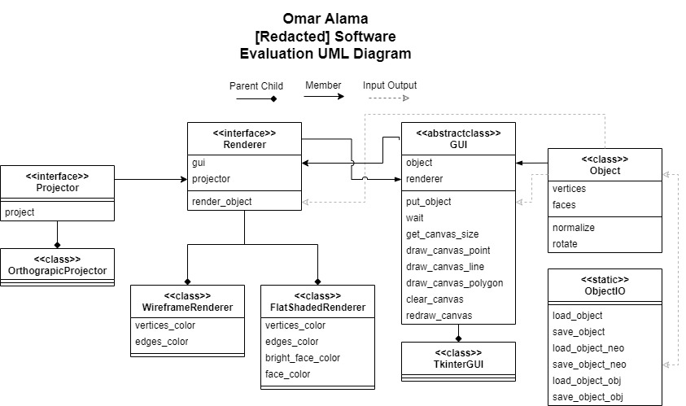

# [Redacted] Software Assessment
Author: Omar Alama (oalama@andrew.cmu.edu)

This repository contains the implementation of the [Redacted] Software Assessment.
The specification is available in the repository as "[Redacted] Software Assessment.doc".

The implementation was done in python to facilitate quick development due to the 2 day time constraint.
While I do believe it would be more efficient performance wise to develop it using C++ (In which I am also fluent), I did not want to get stuck debugging a segmentation fault with only two days.

## 1. Quick Start

### 1.1 Installing Dependencies
The project is fairly self-contained with a few python dependecies that you can look at in `environment.yml`.

Alternatively, if you have [conda](https://docs.conda.io/en/latest/miniconda.html), you can create an environment using the file:
   
    conda env create -n rend -f ./environment.yml

Then activate it by 

    conda activate rend

### 1.2 Running Task 1
    python task1.py --filepath <path_to_3d_object_file>

### 1.3 Running Task 2
    python task2.py --filepath <path_to_3d_object_file>

## 2. Project Design

I utilized a UML diagram to create an object-oriented design where I tried to emphasize seperation of concerns (encapsulation), and future extensibility.

For example, I created a projector interface to separate the task of projecting 3D points onto 2D from the rendering logic. This also makes it easier to implement new projection methods (Perspective projection) without having to go into each renderer and manually change it.

I also separated the library specific GUI logic from the more general rendering logic such that a team member working on rendering need not learn about tkinter and vice versa.

For coding style, I adopted the [Google python](https://google.github.io/styleguide/pyguide.html) style guide.

## 3. Discussion
### 3.1 Task 1
Task 1 was fairly straightforward with no algorithms needed. Assuming the viewer is at an infinite distance from the object corresponds to orthographic projection which can be easily done by dropping the z values.
Rotations were done by multiplying the vertices with a general rotation matrix.

### 3.2 Task 2
For task 2 the challenge was mainly to solve the visible surface problem which can be done using different algorithms each with their pros and cons. I will discuss the top 3 algorithms I considered.

1. Painters Algorithm. This is the simplest algorithm which draws the faces in the order of their z value such that faces closer to the viewer are painted last (on top). The problem with this algorithm is that it does not accurately render intersecting faces among other edge cases. It can also be slow since it has to render all surfaces even non-visible ones (An issue that can be reduced by back face culling).
2. Z-buffering. Yet another simple algorithm that maintains a Z buffer the size of the image and checks it everytime it attempts to paint a pixel to make sure only the highest z value pixels are shown. This is quite accurate however it needs pixel level granuality which is not easily accessible using Tkinter without reimplementing all 2D graphics.
3. Ray-tracing. A popular approach that traces all rays of light from the viewer to the 3D scene rendering the pixel of the first object encountered. This can be rather slow and may be too complicated for our case.

Thus I chose the Painter's algorithm in my implementation given that we are only displaying one object at a time and given that "normal" objects do not tend to have intersecting faces.
Further improvement upon the algorithm can be made using back face culling.

As for the challenge of coloring the faces of the object. I simply calculated the normal of each face by taking the cross product of two edges. Then projected the normal onto the Z axis to see how much the face is oriented towards the viewer. Finally, I linearly interpolated between the two colors based on the projection value.
Note that it does not matter if the calculated face normal was flipped in our case since the coloring would be the same.

### 3.3 Testing
I added a few more test objects in .obj format to test my program. I wanted to see how it would perform on non convex and more complex objects.
It had no issue rendering a sphere (1000 faces) and a torus (non-convex object).
It was struggling to render a tooth with 10K faces whereas displaying the tooth on blender was fairly smooth so there is definitely room for improvement in the
algorithms used as well as the programming language/library.
In terms of rendering inaccuracies the painter's algorithm tackled all of my tested objects correctly.
However, I found that a simple cube (Attached for reference) with two triangles to represent each face can produce error artifacts at some angles.

## 4. Conclusion
The specification has been implemented to the best of my ability given the time constraints.
If this was a real project I would spend more time on implementing a more advanced algorithm for the visible surface 
determination (Ex. z-buffering) as well as implement optimization techniques such as back face culling. I do believe that the 
project design that I spent a decent amount of time on will allow me to easily extend the capabilities of this  program.
